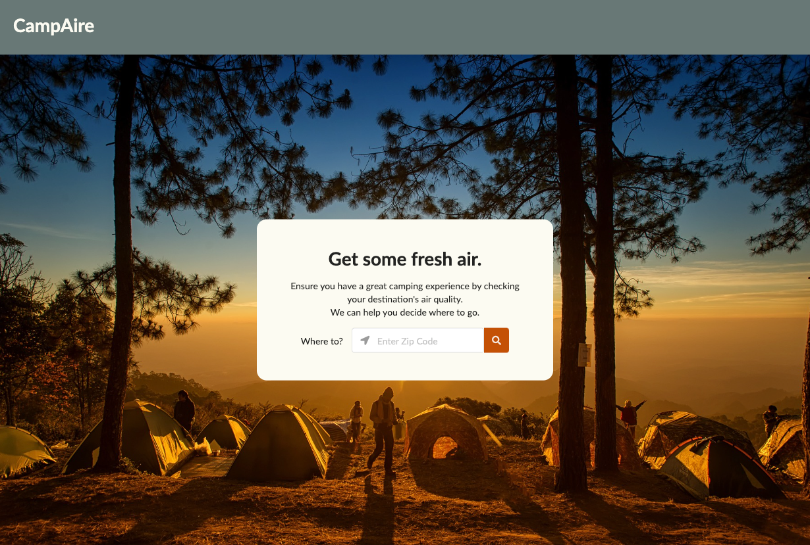
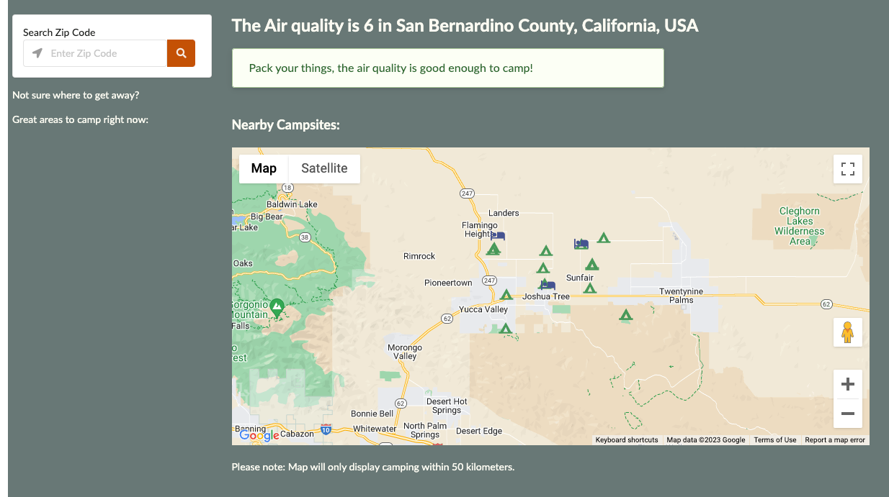
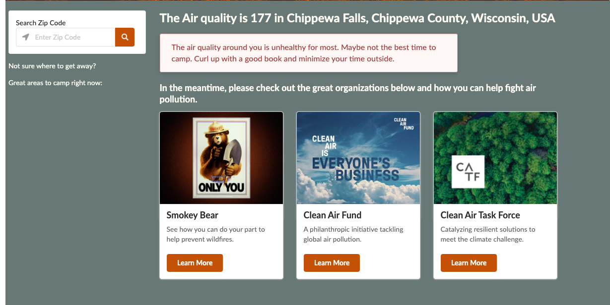

# Air Quality Camping Application

## Description

This application was designed as a response to the University of Oregon's Coding Bootcamp Project 1. It was a collaborative assignment where the members of a given group were required to develop a real-world interactive application that utilizes at least two server-side APIs, a CSS framework other than Bootstrap, a polished UI, and client-side storage. Using Agile software development, our team worked together to create a fully functioning application that met all of the criteria of our given prompt, as well as addresses the crisis of finding outdoor areas of recreation in a world with increasingly poor air quality due to global warming and other negative environmental impacts.

## User Story

```
AS someone who likes to camp in the pacific northwest,
I WANT an application that measures the air quality of a location and suggests nearby campsites if the air quality is good enough
SO THAT I can plan to camp in an area with clean air.
```

## Acceptance Criteria

```
GIVEN an air quality dashboard with a form input
WHEN I input a zip code,
THEN I am given the zip codes's current air quality.
WHEN there is good enough air quality in the area,
THEN I am presented with a list of 5 nearby campgrounds within a given distance.
WHEN The air quality is not good enough in my own zip code,
THEN I am presented with a list of the next-closest campgrounds in other zip codes.
WHEN I click on a listed campground,
THEN I am directed to its Google-listed website for more information.
WHEN There are not any zip codes within the set distance with good enough air quality,
THEN I am presented with a message telling me that I should not go camping at all.
```

## Collaborators

- Michie Willman
- Dusty Brigsby
- Quinn Sargent
- Ethan Gill

## Directions for Future Development

Suggestions for Additional Features:

- Get user location from their IP address (“Use My Location” button)
- Add option for user to select the search distance of campsites from location entered
- Include more weather condition information beyond just AQI
  - Visibility conditions - good for hiking
  - Option to check for specific date
  - UV index - suggest to wear sunscreen
- Add 7-Day AQI forecast (Requires ‘Enterprise’ plan of AirVisual API)
- Add popular hike trailheads in the chosen area
- Add map that includes air quality zones

## Mock-Up

The following image shows the web application's appearance and functionality:







## Deployment

[Click here to view the deployed application.]()

[Click here to view the code repository.](https://github.com/michiewillman/UofO_G4_Project-01)

---

© 2023 edX Boot Camps LLC. Confidential and Proprietary. All Rights Reserved.
